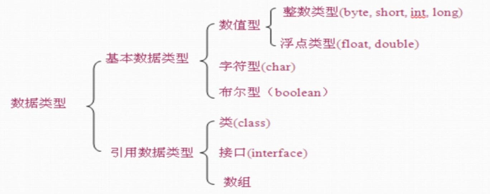

# Java 基础

## 1.Java 环境介绍

### 1.名词解释

- **Java SE(Java Standard Edition)**: 标准版本, 是 Java 的基础,包含 Java 语言基础,JDBC(Java 数据库连接), I/O,网络通信,多线程等技术;
- **Java EE(Java Enterprise Edition)**: 企业版本,主要用于企业级的网络程序;核心为 EJB(企业 Java 组件模型);
- **Java ME(Java Micro Edition)**: 在移动设备和嵌入式设备上运行;
- **JVM(Java Virtual Machine)**: Java 虚拟机;
- **JDK(Java SE Development Kit)**:可以认为就是 Java SE,
- **OpenJDK**:JDK 的一个分支, 开源版本;
- **JRE(Java Runtime Environment JDK)**: Java 运行时环境,包含 Java 虚拟机,Java 基础类库.
- **javac**: Java 的编译器, 用于把 java 源码文件编译为 java 字节码文件;
- **jar包**: 用于把一组`.class`文件打包成一个`.jar`文件,方便发布;
- **jdb**: Java 调试器;

### 2.环境变量

- `JAVA_HOME`: 指定 JDK 安装路径;
- `CLASSPATH`: JVM使用的环境变量, 指示如何搜索`class`;
  - 加载类时的查找路径:
    - 当前目录.
    - `classpath`目录.
  - 启动时, 可以通过`java -classpath xxxx` 指定`classpath`.
  - JVM根本不依赖`classpath`加载核心库！

### 3.语言风格

- 变量,方法名: 首字母小写和驼峰法命名;
- 常量: 所有字母大写, 下划线连接;
- 类名: 首字母大写和驼峰原则;

## 2.基本概念

### 1.数据类型

- 常量: 关键字`final`修饰;
- 变量: 应采用驼峰命名规则;
- 数据类型:

  - **基本数据类型**: 变量存储的时数据本身;
  - **引用数据类型**: 变量保存的数据空间地址;
  - `char`: 2 个字节, 保存 Unicode 编码, 使用单引号;

  

### 2.基础语法

 - 运算符
     - `++`: 自增
        	- 前缀: 先进行自增或者自减运算，再进行表达式运算, 
        	- 后缀: 先进行表达式运算, 再进行自增.
     - `--`: 自减
        	- 前缀, 后缀...
     - 条件运算符:
        	- `(表达式) ? 值1: 值2;` 表达式为真时, 值为值1, 否则为值2
     - `instanceof `: 检查对象是否为类的实例
        	- `object1 instanceof class1`
- 选择结构: 
    - `if() {} else {}`
    - `if () {} else if () {}`
    - `switch(表达式){ case 常量表达式1: xxx; break; case 常量表达式2: xxx;break; default: 语句xxx;}`
- 循环结构:
    - `while(){}`
    - `do {} while();`
    - `for(初始化; 布尔表达式; 更新) {}`
    - `for( 声明语句: 可迭代对象) {}`
        - 编译器会自动将`for each`循环变为`Iterator`调用.

- 声明初始化: 
  - `int[] b = {1,2,3};` 
  - `int[] b = new int[]{1,2,3};`
  - *不可以同时指定长度和指定初始化*

### 4.方法

- `访问修饰符 返回类型 方法名(参数)`
- 

### 5.特殊语法

- `==`: 用于对象, 比较地址是否相同; 对象如果需要比较值, 需要使用`.equals()`方法;
