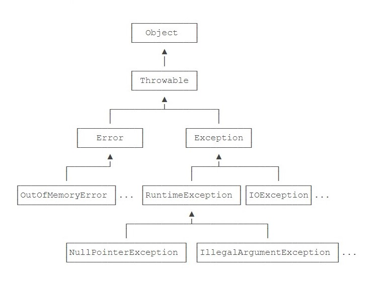

# Java常用工具

## 1.异常

> 异常是一种`class`,  本身带有类型信息.
>
> ```java
> try {
>     String s = processFile(“C:\\test.txt”);
>     // ok:
> } catch (FileNotFoundException e) {
>     // file not found:
> } catch (SecurityException e) {
>     // no read permission:
> } catch (IOException e) {
>     // io error:
> } catch (Exception e) {
>     // other error:
> } finally {
>  	// 正常, 异常 执行完后都会执行
> }
> ```

- 
- `Error`: 验证错误, 程序需要终止.
- `Exception`: 运行时错误, 可被捕获并处理.

- **throw 和 throws**
    - `throw`: 抛出异常, `throw e;`
    - `throws`: 方法可能抛出异常的声明. `public void f() throws Exception1, Exception2 { }`
        - 调用方法的地方必须对其进行捕获并处理.

- 自定义异常:

    - 一般包含两个构造方法: 无参构造方法. 有参构造方法(传入字符串).

    - ```java
        class XxxxException extends Exception {
            
        }
        ```

- 对于异常, 可以使用`e.printStackTrace();`方法打印异常栈;

## 2.包装类

> 通过包装类, 使得基本类型拥有对象的特征和一些特殊的方法.

- 自动装箱`Auto Boxing`:
    - `Integer n = 100;`
    - 编译器会自动将基本类型转为包装类对象.
- 拆箱
  - 从包装类对象转换为对应的基本类型; `int index = i`;


## 3.字符串

### 1.String

- 可以通过`"xxxx"`直接创建(编译器优化).
- 对象本身不可变.

### 2.StringBuilder

- 可变对象, 可以预分配缓冲区.`StringBuilder sb = new StringBuilder(1024);`
- `StringBuffer`: 和`StringBuilder`类似线程安全, 没有`StringBuilder`效率高

## 3.集合

## 4.多线程

### 1.线程创建

> `Thread`: 通过`start()`启动线程, 线程执行`run()`方法;
>
> `Runable`: 用于实现线程的接口, 只有一个`run()`方法;

- 继承`Thread`类, 重写`run()`方法;

```java
class Mythread extends Thread{
    public void run() {
        System.out.println("执行线程");
    }
}
```

- 实例化`Thread`的时候传入一个`Runable`的实例;

```java
public class Main {
    public static void main(String[] args) {
        Thread t = new Thread(new MyRunnable());
        t.start();
    }
}

class MyRunnable implements Runnable {
    @Override
    public void run() {
        System.out.println("执行线程!");
    }
}
```

### 2.线程同步

- `synchronized`: 关键字, 用于对一个对象进行加锁.

```java
synchronized(lock) {
    n = n + 1;
}
```

- 用`synchronized`修饰方法可以把整个方法变为同步代码块, 相当于对`this`进行加锁;

```java
public synchronized void add(int n) {
    count += n;
}

/* 相当于 */

public void add(int n) {
    synchronized(this){
        count += n;
    }
}
```

- `synchronized`的关键就是锁住的对象;

## 5.日志

- Java标准库内置了日志包`java.util.logging`

    - ```java
        import java.util.logging.Leval;
        import java.util.logging.Logger;
        public class Hello {
            public static void main(String[] args) {
                Logger logger = Logger.getGlobal();
                logger.info("start process...");
                logger.warning("memory is running out...");
                logger.fine("ignored.");
                logger.severe("process will be terminated...");
            }
        }
        ```

- `Commons Logging`日志模块

    - ```java
        import org.apache.commons.logging.Log;
        import org.apache.commons.logging.LogFactory;
        
        public class Main {
            public static void main(String[] args) {
                Log log = LogFactory.getLog(Main.class);
                log.info("start...");
                log.warn("end.");
            }
        }
        
        ```

## 6.IO

## 反射

## 泛型

## IO


