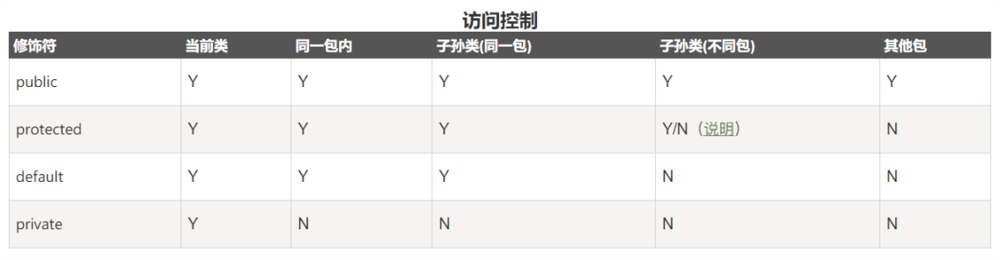

# Java面向对象

> 对象的声明和实例化: `类名 对象名 = new 类名([参数]);`
>
> 声明变量: 在栈中, `new`实例化: 在堆中. 
>
> 一个 java 文件中可以定义多个类, 但最多只有一个类被`public`修饰, 并且这个类名与文件名必须相同;
>
> 类名的命名规则: **首字母大写, 驼峰命名规则;**

## 1.修饰符

> 用于修饰类, 方法, 或者属性. 通常放在语句最前端.

### 1.访问权限控制

- `default` (即缺省，什么也不写）: 在同一包内可见。使用对象：类、接口、变量、方法;

    - 接口中, `default`修饰的方法为`default`方法,  实现类可以不必要覆写`default`方法.

- `public` : 对所有类可见。使用对象：类、接口、变量、方法;

- `protected` : 对同一包内的类和所有子类可见。使用对象：变量、方法。 **注意：不能修饰类（外部类）**;

- `private` : 在同一类内可见。使用对象：变量、方法。 **注意：不能修饰类（外部类）**;

  

### 2.非访问修饰符

- `static`: 
    - 静态属性: 所有实例共享一个静态字段, 推荐使用`类名.静态字段`访问静态对象.
        - 接口的静态属性: 必须是静态, 常量`public static final int xxx;`
        - 对于接口的属性, 编译器会默认加上`public static final`修饰.
    - 静态方法: 属于`class`而不属于实例.
- `final`: 
    - 常量.
    - 不可重写方法.
    - 不可继承类.
- `abstract`: 
    - 抽象类.
    - 抽象方法, 只含有声明, 没有定义的方法. 含有抽象方法的类一定是抽象类, 需要用`abstract`修饰.
- `synchronized`: 修饰方法, 同一时间只能被一个线程访问.
    - 修饰方法: `public synchronized void xxx(){}`
    - 修饰代码块: `synchronized( xxx ) {}`
- `volatile`: 成员变量每次被访问时, 都**强制从共享内存中重新读取该成员的值**.
    - Java线程内存模型确保所有线程看到这个变量的值是一致的.
    - 当写一个volatile变量时，JMM会把该线程对应的本地内存中的共享变量值刷新到主内存.
    - 当读一个volatile变量时，JMM会把该线程对应的本地内存置为无效。线程接下来将从主内存中读取共享变量,并更新本地内存的值.

## 2.方法和属性

### 1.方法

> `访问修饰符 返回类型 方法名(参数)`

- `this`: 在方法内使用, 代码对象本身;
- 参数传递: 对于基本类型参数: 值传递. 对于引用数据类型: 引用传递.
- 可变参数列表`void sum(int...n)`
- 可以传入多个参数, 也可以传入数组;
  - 可变参数必须放在参数末尾;
  - 方法重载时, 优先调用不含有可变参数的方法;
  - 函数内部, 可变参数作为数组使用.
- 方法重载
    - 同一类中, 方法名相同, 但参数不同的方法;
- 静态属性和方法
    - 空间在所有的实例间共享;
    - 推荐使用类名访问静态字段;

### 2.构造方法

- **方法名与类名相同且无返回值(`void`省略)的方法, 一般用public修饰**;
- 默认构造方法: 没有定义构造方法时, 系统自动生成的构造方法.
- 当没有提供构造方法时, 系统会默认生成一个无参的默认构造方法(所以`new`的时候不传参), 但是当用户定义了构造方法后, 就不会自动生成默认构造方法(所以`new`的时候必须根据构造方法进行传参), 可以定义多个构造方法, 相互之间是重载方法;

## 3.封装

### 1.包

> java中定义了一种命名空间, 称为包`package`;
>
> 类文件使用`package 包名;`声明类所在的包;
>
> 使用时通过`import`导入包内的类;

- 定义类的时候, 需要在第一行声明这个`class`属于哪个包: `package p1`;
- Java虚拟机执行的时候, 只看完整类名;
- 包之间没有父子层级关系, 只有包名的不同;
- 所有Java文件对应的目录层级也要和包的层次一致; 编译后的`.class`文件也按照包结构存放; 编译使用`javac`;
- 如果需要引用其他包中的类, 需要使用`import`导入;

### 2.jar包

> 将`package`组织的目录层级, 以及各个目录下的所有文件(包括`.class`和其他文件)都打成一个jar文件(**实质是一个压缩文件**)

- 执行时, 将jar包路径放入`classpath`. `java -cp ./hello.jar abc.xyz.Hello` JVM 会自动在jar包中查找`abc.xyz.Hello`执行.

## 4.继承

- Java 是单继承, 一个类有且仅有一个父类, 只有`Object`没有父类;

- 继承的语法: `class ChildrenClass extends FatherClass{}`

- `super`关键字: 在子类中访问父类的方法和属性(子类可见的也可以直接访问);
  - `super`就代表父类的存储空间表示(或者说父类的引用).
  - 子类构造方法的第一行必须调用父类的构造方法, 当无显式调用时,  默认会加上`super()`.
- 需要放在子类构造方法的最前面调用`super(x,x,x)`;
  
- `instanceof`运算符: 判断对象是否为某个类的实例 `dog instanceof Animal`;

- 重写方法:
  - 重写函数的访问修饰符权限只能大于等于父类方法的访问权限;

- `Object`类: 所有类都继承至`Object`类;
  - 提供了`toString(), equals()`等方法, 可以根据需要进行重写;
  - `equals()`: 对象内容的比较, 类需要内容比较时可以重写该方法;
  - `clone()`: 创建并返回一个对象拷贝;
  - `toString()`: 返回一个对象的字符串表示;

## 5.多态

- `Java`实例方法调用是基于运行时的实际类型动态调用的(实例的实际方法).

## 6.抽象类

> 含有抽象方法的类

- 抽象方法:
  - 父类本身不需要实现, 仅作为标识, 仅仅定义方法, 需要子类实现;
  - 方法用`abstract`修饰, `abstract void func(){}`;
  - 存在抽象方法时, 类也必须使用`abstract`修饰;
- 抽象类只能被继承, **不能被实例化**;
- 继承抽象的类的子类如果也没有定义该函数,则也会成为抽象类, 只能被继承;

## 7.接口

> 接口并不是类, 而是另外一种引用数据类型, (引用类型包括: 数组, 接口, 类);
>
> 用`interface`关键字修饰: `interface Person{}`;

- 一个类只能继承一个父类, 但是可以实现多个接口;

```java
class ClassName implements Interface1, Interface2{
    ...
}
```

- 接口也可以继承另一个或多个接口;
- 成员都为常量或抽象方法;
- 接口中的所有方法都是使用`public abstract`修饰, 可是省略;
- 接口中的所有属性都是使用`public static final`修饰, 可以省略;
- 接口实现: 类通过`implements 接口1,接口2`来实现一个或多个接口;

## 8.内部类

- **内部类**: （ Inner Class ）就是在一个类里面定义的类。与之对应，包含内部类的类被称为外部类。

- 内部类提供了更好的封装，可以把内部类隐藏在外部类之内，不允许同一个包中的其他类访问该类
  - 内部类的方法可以直接访问外部类的所有数据，包括私有的数据
  - 内部类所实现的功能使用外部类同样可以实现，只是有时使用内部类更方便

- 内部类可以分为: `成员内部类, 静态内部类, 方法内部类, 匿名内部类`
  - 静态内部类: `static`修饰, 只能直接访问外部类的静态成员;
  - 方法内部类: 定义在一个方法里的, 也称为局部内部类;
  - 匿名内部类: 没有名字的类, 内部类的简化写法;

- 

## 9.其他

- 构造代码块, 静态构造代码块`{}`:

  - 如果放在方法中, 为普通代码块, 定义的变量为块作用域;
  - 放在类中, 为构造代码块, 实例化对象的时候调用;
  - `static`修饰的构造代码块: 只在类加载的时候执行一次, 仅可对静态成员赋值;

  ```java
  class ClassName{
      {
          // 构造代码块;
      }
  }
  ```

  

